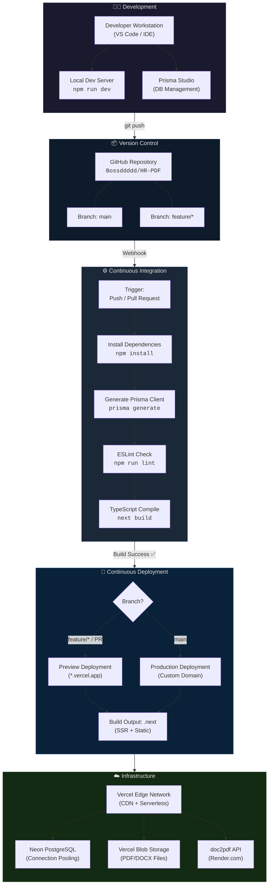
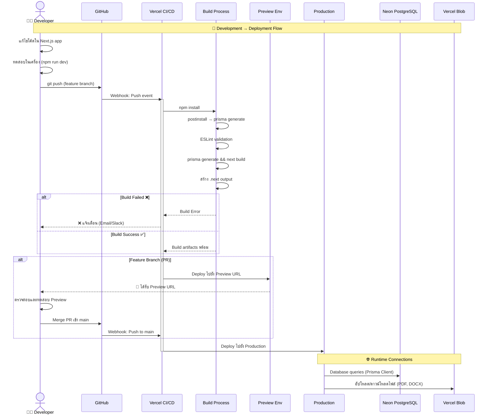
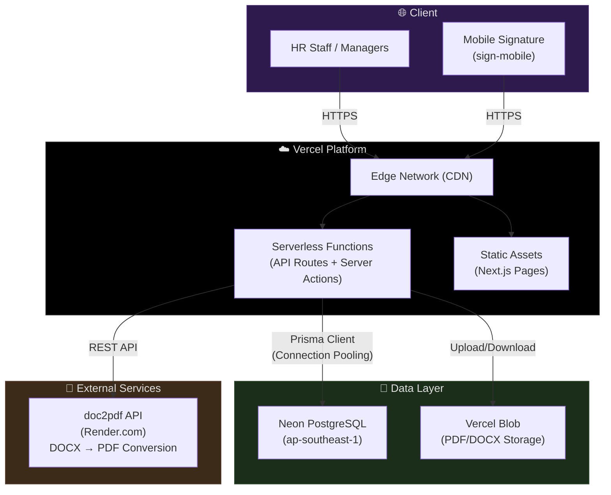
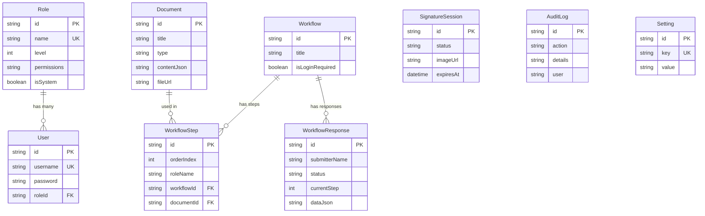

# HR-PDF — ระบบสร้างแบบฟอร์ม PDF อัตโนมัติสำหรับงาน HR

> ระบบจัดการเอกสาร HR แบบดิจิทัล รองรับการสร้างแบบฟอร์มแบบ Dynamic, ลงลายเซ็นอิเล็กทรอนิกส์, Workflow อนุมัติหลายขั้นตอน และส่งออกเป็น PDF/DOCX อัตโนมัติ

---

## 📋 สารบัญ

- [Tech Stack](#-tech-stack)
- [Features](#-features)
- [Getting Started](#-getting-started)
- [Project Structure](#-project-structure)
- [CI/CD Pipeline](#-cicd-pipeline)
- [Infrastructure](#-infrastructure)
- [Database Schema](#-database-schema)
- [Environment Variables](#-environment-variables)

---

## 🛠 Tech Stack

| Layer | Technology |
|-------|------------|
| **Framework** | Next.js 16 (App Router, Server Actions) |
| **Language** | TypeScript |
| **Styling** | TailwindCSS 4 |
| **ORM** | Prisma 7 |
| **Database** | Neon PostgreSQL (ap-southeast-1) |
| **File Storage** | Vercel Blob |
| **PDF Generation** | pdf-lib, docxtemplater |
| **Deployment** | Vercel |
| **Doc Conversion** | doc2pdf API (Render.com) |

---

## ✨ Features

- **Document Builder** — สร้างเอกสาร HR แบบ Canvas (ลาก-วาง) หรืออัปโหลดไฟล์ PDF/Word
- **Workflow Management** — กำหนดขั้นตอนอนุมัติหลายระดับ (User → Manager → HR)
- **Electronic Signature** — ลงลายเซ็นผ่านมือถือด้วย QR Code (sign-mobile)
- **PDF/DOCX Export** — ส่งออกเอกสารเป็น PDF หรือ DOCX พร้อมข้อมูลที่กรอกแล้ว
- **Role-Based Access** — ระบบ Role & Permission ควบคุมสิทธิ์การเข้าถึง
- **Admin Dashboard** — จัดการเอกสาร, ผู้ใช้, บทบาท, และดู Audit Logs
- **Inbox System** — ระบบแจ้งเตือนและติดตามสถานะเอกสาร

---

## 🚀 Getting Started

### Prerequisites

- Node.js 18+
- npm

### Installation

```bash
# Clone repository
git clone https://github.com/Bossddddd/HR-PDF.git
cd HR-PDF

# ติดตั้ง dependencies (จะ generate Prisma Client อัตโนมัติผ่าน postinstall)
npm install

# ตั้งค่า environment variables
cp .env.example .env
# แก้ไขค่าใน .env ให้ตรงกับ database ของคุณ

# รัน development server
npm run dev
```

เปิด [http://localhost:3000](http://localhost:3000) เพื่อเข้าใช้งาน

### Scripts

| Command | Description |
|---------|-------------|
| `npm run dev` | รัน development server |
| `npm run build` | Build production (`prisma generate && next build`) |
| `npm run start` | รัน production server |
| `npm run lint` | ตรวจสอบโค้ดด้วย ESLint |

---

## 📁 Project Structure

```
HR-PDF/
├── prisma/
│   └── schema.prisma          # Database schema (Role, User, Document, Workflow ฯลฯ)
├── public/                    # Static assets
├── src/
│   ├── app/
│   │   ├── actions/           # Server Actions
│   │   ├── admin/             # Admin Dashboard (documents, forms, roles, users, logs)
│   │   ├── api/               # API Routes (export-document, file, seed)
│   │   ├── context/           # React Context (Auth, Role)
│   │   ├── form/              # แบบฟอร์มสำหรับผู้ใช้กรอกข้อมูล
│   │   ├── inbox/             # ระบบติดตามสถานะเอกสาร
│   │   ├── sign-mobile/       # ลงลายเซ็นผ่านมือถือ
│   │   ├── layout.tsx         # Root Layout
│   │   ├── page.tsx           # หน้าแรก (Login / Landing)
│   │   └── globals.css        # Global styles
│   ├── components/            # Shared components (Header, RoleGuard, RoleSwitcher)
│   └── lib/
│       └── prisma.ts          # Prisma Client singleton
├── vercel.json                # Vercel deployment config
├── package.json
└── tsconfig.json
```

---

## 🔄 CI/CD Pipeline

โปรเจกต์นี้ใช้ **Vercel Git Integration** สำหรับ CI/CD Pipeline แบบอัตโนมัติ — ไม่ต้องเขียน GitHub Actions หรือ CI config เพิ่มเติม ทุกอย่าง trigger อัตโนมัติเมื่อ push code ไปยัง GitHub

### Architecture Overview



### Deployment Flow



### Build Steps

| Step | Command | รายละเอียด |
|------|---------|------------|
| 1️⃣ Install | `npm install` | ติดตั้ง dependencies ทั้งหมด |
| 2️⃣ Postinstall | `prisma generate` | สร้าง Prisma Client จาก schema.prisma |
| 3️⃣ Lint | `npm run lint` | ตรวจสอบคุณภาพโค้ดด้วย ESLint |
| 4️⃣ Build | `prisma generate && next build` | Build production bundle (SSR + Static) |
| 5️⃣ Output | `.next/` directory | Vercel deploy จาก output directory นี้ |

### Pipeline Features

| Feature | รายละเอียด |
|---------|------------|
| **Auto Preview** | ทุก PR / branch ได้ Preview URL อัตโนมัติ |
| **Zero-Downtime Deploy** | ใช้ immutable deployments ไม่มี downtime |
| **Instant Rollback** | สามารถ rollback ไปยัง deployment ก่อนหน้าได้ทันที |
| **Edge Caching** | Static pages ถูก cache ที่ Edge Network ทั่วโลก |
| **Serverless Functions** | API Routes ทำงานเป็น serverless functions |
| **Connection Pooling** | Neon PostgreSQL ใช้ PgBouncer สำหรับ connection pooling |

---

## ☁️ Infrastructure



---

## 🗄 Database Schema



---

## 🔐 Environment Variables

| Variable | รายละเอียด | ตัวอย่าง |
|----------|------------|---------|
| `DATABASE_URL` | Neon PostgreSQL connection string (pooled) | `postgresql://...pooler.neon.tech/neondb` |
| `DATABASE_URL_UNPOOLED` | Direct connection (ไม่ผ่าน PgBouncer) | `postgresql://...neon.tech/neondb` |
| `BLOB_READ_WRITE_TOKEN` | Vercel Blob access token | `vercel_blob_rw_...` |
| `BLOB_STORE_ID` | Vercel Blob store identifier | `store_...` |
| `PDF_CONVERTER_URL` | doc2pdf API endpoint | `https://doc2pdf-....onrender.com/api/convert-to-pdf` |

> **หมายเหตุ**: ไฟล์ `.env` อยู่ใน `.gitignore` — ไม่ถูก commit ขึ้น repository ตั้งค่า environment variables ผ่าน Vercel Dashboard สำหรับ Preview และ Production

---

## 📄 License

Private — Internal use only.
